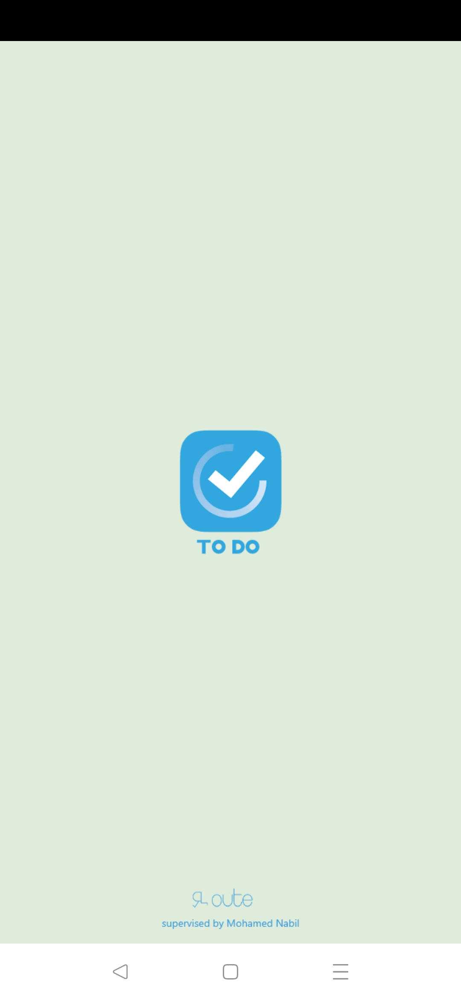
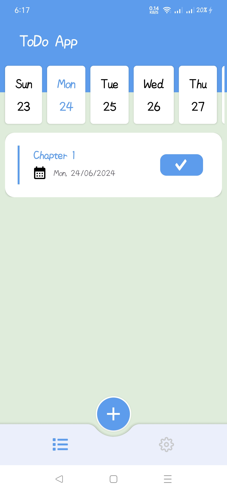
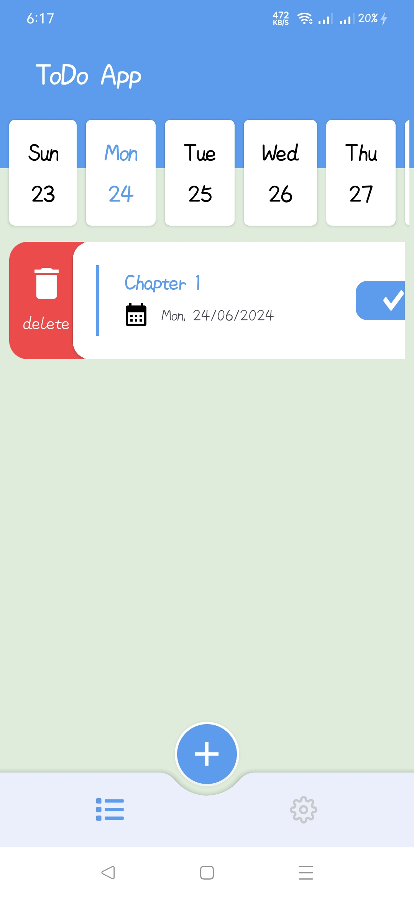
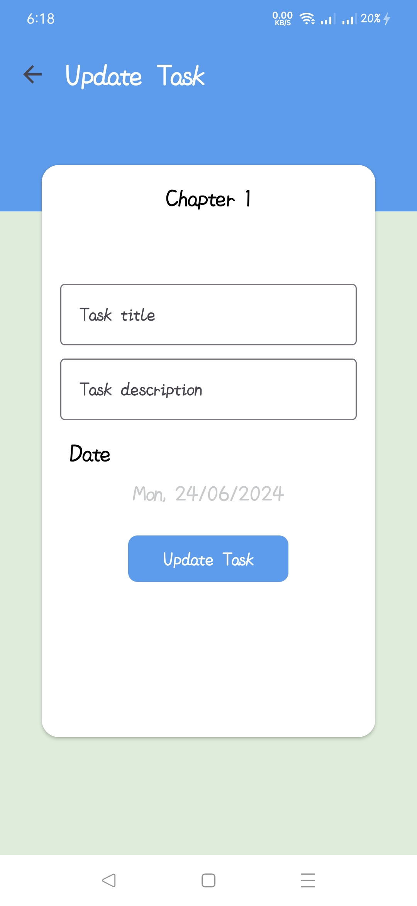
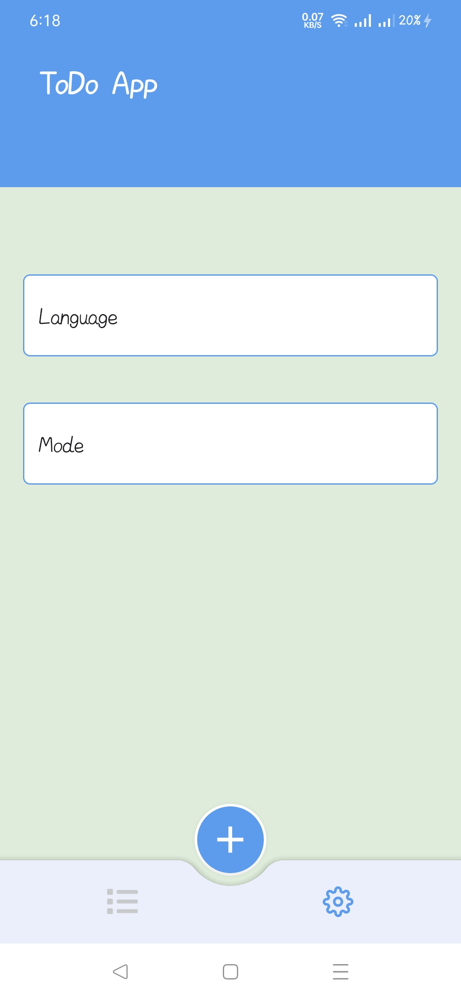

<div align="center">


# **ToDo**

ToDo is a task management app to help you stay organized and manage your day-to-day.


<br/>

</div>

## 🚀 Features
- 📝 **Create and Edit Tasks**
- 🗓️ **Manage tasks in Calendar View**
- 🎨 **Modern UI with Cool Themes**

## Screenshots

  
<br>
  

### Installing

1. Clone the repository
``` git clone https://github.com/ahmedmahgoub0/TodoApp.git ```
2. Open the project in Android Studio
3. Build and run the app
